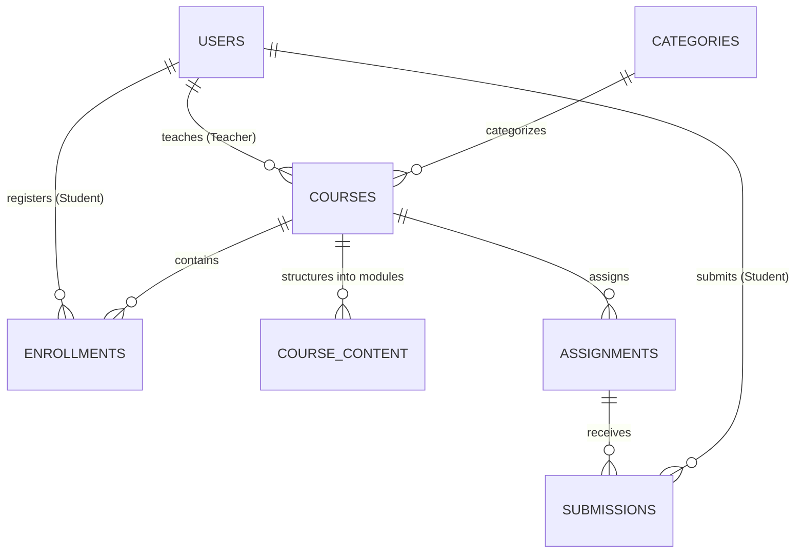

# Student Learning Management System (Student LMS)
> A full-stack, enterprise-grade educational platform built with **Python 3.11+**, **FastAPI**, **MySQL 8.0+**, **parameterized RAW SQL**, and **React 18 (Vite)**.
> **Zero ORM Overhead**: Designed specifically to showcase relational database design, ANSI SQL joins, ACID transactions, B-Tree indexing, and role-based access control.

---

## 1. Project Overview
The **Student Learning Management System** is a full-featured academic portal engineered for colleges, online academies, and training bootcamps. It bridges institutional administrators, faculty educators, and enrolled students through intuitive workflows:
- **Administrative Control**: User lifecycle, faculty assignment, course catalog publishing, and telemetry.
- **Faculty Coursework Pipeline**: Multi-module syllabus creation (videos, documents, articles), coursework authoring with deadlines, and grading with feedback.
- **Student Academic Journey**: Course discovery, transactional enrollment, interactive syllabus tracking, solution submissions, and cumulative gradebooks.

---

## 2. Technology Stack

| Layer | Technologies | Rationale |
|---|---|---|
| **Backend** | Python 3.11+, FastAPI, Uvicorn, Pydantic v2 | High-concurrency ASGI framework, native dependency injection, and declarative schema validation |
| **Database** | MySQL 8.0+ (InnoDB Engine) | Normalized 3NF relational schema with foreign key integrity and secondary B-Tree indexes |
| **SQL Layer** | **Parameterized RAW SQL (`%s`)** | **Strictly NO ORM** (no Django ORM, SQLAlchemy, or Prisma). Direct SQL execution preventing SQL injection |
| **Database Pooling** | `mysql.connector.pooling.MySQLConnectionPool` | Thread-safe connection pool with automated transaction commit / rollback handlers |
| **Security** | PyJWT (HMAC-SHA256), bcrypt (Salted digests) | Cryptographically signed bearer tokens and one-way password hashing |
| **Frontend** | React 18, Vite, React Router v6, Axios, Vanilla CSS | Responsive, glassmorphic dark-mode LMS UI with role-based routing and live progress tracking |
| **Testing** | Pytest, HTTPX TestClient | 27 comprehensive automated tests covering auth, course lifecycle, enrollment, and security |

---

## 3. System Architecture

```
[ Client Browser (React + Vite) ]
                |
           REST / JSON (HTTPS / JWT Bearer)
                v
  [ FastAPI Web Server (Uvicorn) ]
   ├── Authentication & RBAC Dependencies (require_admin, require_teacher, require_student)
   ├── Centralized Exception & Validation Handlers (Consistent JSON envelopes)
   ├── Service Layer (Raw SQL Query Formulations)
   └── Thread-Safe Connection Pool (MySQLConnectionPool)
                |
         Parameterized SQL (%s)
                v
   [ MySQL 8.0 Relational Database (InnoDB) ]
   ├── 7 Normalized Tables (users, categories, courses, enrollments, course_content, assignments, submissions)
   ├── Foreign Keys (ON DELETE CASCADE / ON DELETE RESTRICT)
   └── 9 Performance B-Tree Indexes
```

---

## 4. Database Design & Tables



### Table Summary
1. **`users`**: Surrogate PK `id`, `first_name`, `last_name`, `email` (`UNIQUE`), `password_hash`, `phone`, `role` (`ADMIN`, `TEACHER`, `STUDENT`), `is_active`.
2. **`categories`**: `id`, `name` (`UNIQUE`), `description`.
3. **`courses`**: `id`, `title`, `description`, `category_id` (FK `RESTRICT`), `teacher_id` (FK `RESTRICT`), `duration_hours`, `level`, `status` (`DRAFT`, `PUBLISHED`, `ARCHIVED`).
4. **`enrollments`**: `id`, `student_id` (FK `CASCADE`), `course_id` (FK `CASCADE`), `progress` (0.00-100.00), `status`. Enforces `UNIQUE(student_id, course_id)`.
5. **`course_content`**: `id`, `course_id` (FK `CASCADE`), `title`, `description`, `content_type` (`VIDEO`, `DOCUMENT`, `ARTICLE`, `LINK`), `content_url`, `order_index`.
6. **`assignments`**: `id`, `course_id` (FK `CASCADE`), `title`, `description`, `due_date`, `max_marks`.
7. **`submissions`**: `id`, `assignment_id` (FK `CASCADE`), `student_id` (FK `CASCADE`), `submission_text`, `submission_url`, `submitted_at`, `marks`, `feedback`, `status` (`SUBMITTED`, `GRADED`, `LATE`). Enforces `UNIQUE(assignment_id, student_id)`.

---

## 5. Quick Start & Setup Guide

### 1. Prerequisites
- **Python 3.11+**
- **Node.js 18+** and `npm`
- **MySQL Server 8.0+** running on `localhost:3306`

### 2. Database Initialization
Log into MySQL and execute the schema and seed scripts:
```bash
# In MySQL terminal or PowerShell:
mysql -u root -p -e "CREATE DATABASE IF NOT EXISTS student_lms CHARACTER SET utf8mb4 COLLATE utf8mb4_unicode_ci;"
mysql -u root -p student_lms < database/schema.sql
mysql -u root -p student_lms < database/seed.sql
```

### 3. Backend Setup
```bash
cd backend

# Create and activate virtual environment
python -m venv .venv
# On Windows:
.venv\Scripts\activate
# On Linux/macOS:
source .venv/bin/activate

# Install dependencies
pip install -r requirements.txt

# Start backend server
uvicorn app.main:app --host 127.0.0.1 --port 8000 --reload
```
The backend API and interactive documentation are now accessible at:
- **Root API**: [http://127.0.0.1:8000/](http://127.0.0.1:8000/)
- **Swagger UI**: [http://127.0.0.1:8000/docs](http://127.0.0.1:8000/docs)
- **ReDoc**: [http://127.0.0.1:8000/redoc](http://127.0.0.1:8000/redoc)

### 4. Frontend Setup
In a new terminal window:
```bash
cd frontend

# Install Node dependencies
npm install

# Start Vite development server
npm run dev
```
Open [http://localhost:5173](http://localhost:5173) in your browser.

---

## 6. Pre-Configured Demo Credentials

All seed accounts share the documented password: `Password123!`

| Role | Email | Password | Primary Capabilities |
|---|---|---|---|
| **ADMIN** | `admin@lms.com` | `Password123!` | User management, category taxonomy, faculty reassignment, system telemetry |
| **TEACHER** | `teacher@lms.com` | `Password123!` | Create courses, publish syllabus modules, author coursework, grade submissions |
| **STUDENT** | `student@lms.com` | `Password123!` | Browse catalog, enroll in courses, study modules, submit assignments, view gradebook |

*(The Sign In page also includes 1-click quick login buttons for instant evaluation)*

---

## 7. Running Automated Tests

Run the complete 27-test automated test suite using `pytest`:
```bash
cd backend
.venv\Scripts\activate
pytest tests -v
```

### What is tested:
- **Authentication**: Registration with unique email, rejection of duplicates (409), password hashing, successful login, rejection of invalid passwords (401), JWT verification, expired token rejection.
- **Courses**: Teacher course creation, public listing, course retrieval by ID, 404 for missing course, updating own course, filtering & pagination.
- **Enrollments**: Transactional enrollment, duplicate enrollment rejection (409), draft course rejection, my-courses retrieval, progress calculation.
- **Assignments & Grading**: Creation, submission before deadline, late submission detection, teacher grading, marks bounds validation (`marks <= max_marks`), student gradebook.
- **Security & RBAC**: Student blocked from admin APIs (403), student blocked from creating courses (403), teacher blocked from modifying another teacher's course (403), unauthenticated access rejected (401).

---

## 8. Documentation Index

- [Architecture & System Design](file:///c:/Users/shaik/OneDrive/Documents/Student-lms/docs/architecture.md)
- [Database Design & Normalization](file:///c:/Users/shaik/OneDrive/Documents/Student-lms/docs/database-design.md)
- [REST API Specification](file:///c:/Users/shaik/OneDrive/Documents/Student-lms/docs/api-documentation.md)
- [Technical Interview Guide & 30+ Q&As](file:///c:/Users/shaik/OneDrive/Documents/Student-lms/docs/interview-questions.md)
- [Production SQL Query Reference](file:///c:/Users/shaik/OneDrive/Documents/Student-lms/database/queries.sql)
