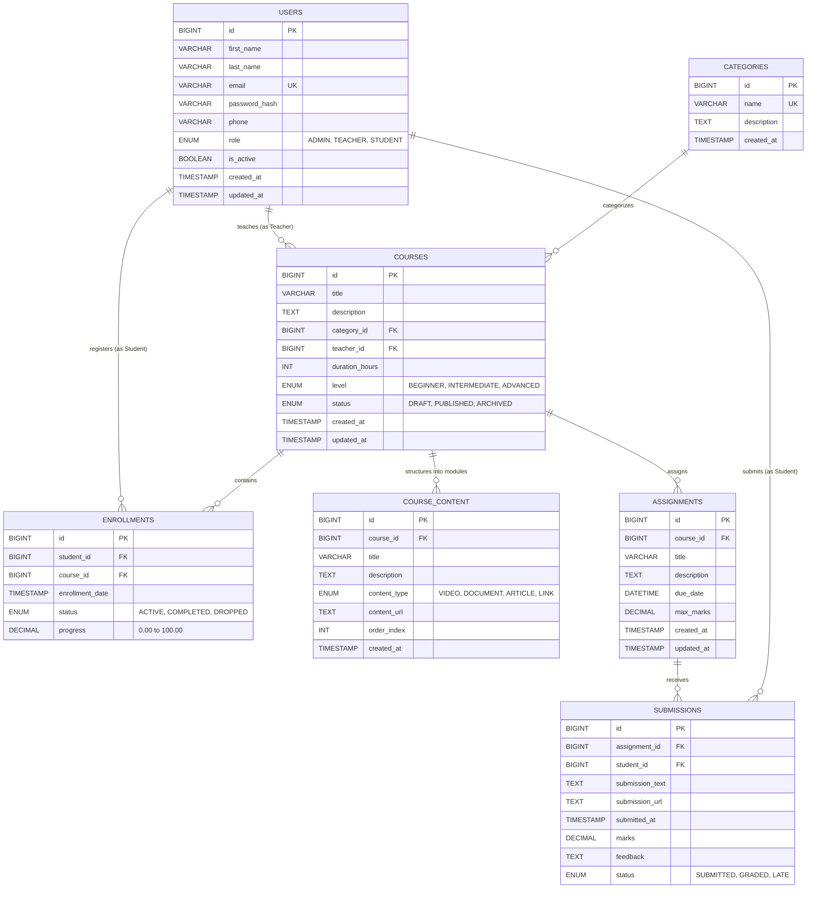

# Database Design & Architecture Specification
**Student Learning Management System (Student LMS)**
**Database Engine**: MySQL 8.0+ (InnoDB Storage Engine)
**Query Paradigm**: Parameterized RAW SQL (Strictly zero ORM abstractions)

---

## 1. Entity-Relationship (ER) Diagram



---

## 2. Relational Normalization Analysis

The schema adheres strictly to **Third Normal Form (3NF)** and **Boyce-Codd Normal Form (BCNF)**:

1. **First Normal Form (1NF)**:
   - Every column holds atomic, indivisible values (e.g., student names are split into `first_name` and `last_name`; URLs and scores are stored individually).
   - No repeating groups or serialized JSON arrays masquerading as relational data.
   - Each table defines a distinct numeric surrogate Primary Key (`id BIGINT AUTO_INCREMENT`).

2. **Second Normal Form (2NF)**:
   - All tables are in 1NF.
   - Every non-key attribute is fully functionally dependent on the primary key. In composite junction concepts like `enrollments` (`student_id`, `course_id`) and `submissions` (`assignment_id`, `student_id`), surrogate keys are complemented by explicit compound UNIQUE constraints.

3. **Third Normal Form (3NF)**:
   - All tables are in 2NF.
   - No transitive functional dependencies exist ($X \to Y$ and $Y \to Z$). For example, course metadata does not embed the category name or teacher's email address directly. Instead, foreign keys (`category_id`, `teacher_id`) reference their respective independent relation.

---

## 3. Tables, Primary Keys, Foreign Keys & Referential Integrity

### A. `users`
- **Primary Key**: `id` (`BIGINT AUTO_INCREMENT`)
- **Unique Constraints**: `UNIQUE(email)`
- **Check/Enum**: `role IN ('ADMIN', 'TEACHER', 'STUDENT')`
- **Business Rule**: System security requires `password_hash` to store one-way bcrypt digests. Plaintext passwords are never persisted.

### B. `categories`
- **Primary Key**: `id` (`BIGINT AUTO_INCREMENT`)
- **Unique Constraints**: `UNIQUE(name)`

### C. `courses`
- **Primary Key**: `id` (`BIGINT AUTO_INCREMENT`)
- **Foreign Keys**:
  - `category_id -> categories.id` (`ON DELETE RESTRICT ON UPDATE CASCADE`)
    *Rationale*: Prevents accidental deletion of academic categories that currently group active courses.
  - `teacher_id -> users.id` (`ON DELETE RESTRICT ON UPDATE CASCADE`)
    *Rationale*: Protects courses from orphaned states if a teacher account is removed; courses must be reassigned by an Admin.

### D. `enrollments`
- **Primary Key**: `id` (`BIGINT AUTO_INCREMENT`)
- **Unique Constraints**: `CONSTRAINT uq_student_course UNIQUE (student_id, course_id)`
  *Rationale*: Strictly prevents duplicate student enrollments in the same course.
- **Foreign Keys**:
  - `student_id -> users.id` (`ON DELETE CASCADE ON UPDATE CASCADE`)
  - `course_id -> courses.id` (`ON DELETE CASCADE ON UPDATE CASCADE`)

### E. `course_content`
- **Primary Key**: `id` (`BIGINT AUTO_INCREMENT`)
- **Foreign Keys**:
  - `course_id -> courses.id` (`ON DELETE CASCADE ON UPDATE CASCADE`)
    *Rationale*: Syllabus chapters and lecture links belong intrinsically to a course lifecycle.

### F. `assignments`
- **Primary Key**: `id` (`BIGINT AUTO_INCREMENT`)
- **Foreign Keys**:
  - `course_id -> courses.id` (`ON DELETE CASCADE ON UPDATE CASCADE`)

### G. `submissions`
- **Primary Key**: `id` (`BIGINT AUTO_INCREMENT`)
- **Unique Constraints**: `CONSTRAINT uq_assignment_student UNIQUE (assignment_id, student_id)`
  *Rationale*: A student submits work once per assignment, updating their draft/submission if permitted until graded.
- **Foreign Keys**:
  - `assignment_id -> assignments.id` (`ON DELETE CASCADE ON UPDATE CASCADE`)
  - `student_id -> users.id` (`ON DELETE CASCADE ON UPDATE CASCADE`)

---

## 4. Indexing Strategy & Performance Rationales

In production database systems, unindexed queries cause full table scans ($O(N)$ disk I/O). B-Tree secondary indexes reduce lookup and range scan times to $O(\log N)$:

| Index Name | Table | Columns | Technical Rationale |
|---|---|---|---|
| `idx_courses_teacher` | `courses` | `teacher_id` | Accelerates teacher dashboard filters: `WHERE teacher_id = %s`. Eliminates full table scans on course lookups. |
| `idx_courses_category` | `courses` | `category_id` | Speeds up catalog filtering by topic: `WHERE category_id = %s`. |
| `idx_courses_status` | `courses` | `status` | Enhances public course catalog loading where `WHERE status = 'PUBLISHED'` is filtered continuously. |
| `idx_enrollments_student` | `enrollments` | `student_id` | Directly resolves student dashboard queries: `SELECT * FROM enrollments WHERE student_id = %s`. |
| `idx_enrollments_course` | `enrollments` | `course_id` | Speeds up course roster lookups for teachers and attendance checks. |
| `idx_content_course_order` | `course_content` | `(course_id, order_index)` | Composite index that filters by course and sorts syllabus modules in order without secondary filesort. |
| `idx_assignments_course` | `assignments` | `course_id` | Optimizes fetching assignment lists for enrolled students: `WHERE course_id = %s`. |
| `idx_submissions_student` | `submissions` | `student_id` | Accelerates fetching student grade history and submission status. |
| `idx_submissions_assignment`| `submissions` | `assignment_id` | Optimizes teacher grading queues for specific assignments. |

---

## 5. ACID Transaction Management in Python

To prevent race conditions, orphan states, and partial writes, multi-step mutations execute within atomic transaction blocks.

### Concrete Example: Student Enrollment Flow
```python
with get_db_connection() as conn:
    cursor = conn.cursor(dictionary=True)
    try:
        # Step 1: Verify student active status
        cursor.execute("SELECT id, is_active FROM users WHERE id = %s;", (student_id,))
        student = cursor.fetchone()
        if not student or not student["is_active"]:
            raise BadRequestException("Invalid or inactive student account.")

        # Step 2: Verify course published status
        cursor.execute("SELECT id, status FROM courses WHERE id = %s;", (course_id,))
        course = cursor.fetchone()
        if not course or course["status"] != "PUBLISHED":
            raise BadRequestException("Course is not available for enrollment.")

        # Step 3: Prevent duplicate enrollment
        cursor.execute("SELECT id FROM enrollments WHERE student_id = %s AND course_id = %s;", (student_id, course_id))
        if cursor.fetchone():
            raise ConflictException("Student already enrolled.")

        # Step 4: Insert enrollment
        cursor.execute(
            "INSERT INTO enrollments (student_id, course_id, status, progress) VALUES (%s, %s, 'ACTIVE', 0.00);",
            (student_id, course_id)
        )
        
        # Step 5: Explicit COMMIT
        conn.commit()
    except Exception as exc:
        # Step 6: Atomic ROLLBACK on any failure
        conn.rollback()
        raise exc
    finally:
        cursor.close()
```
